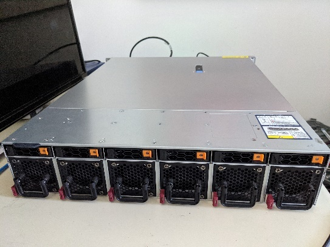
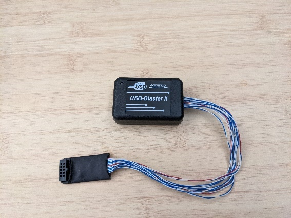
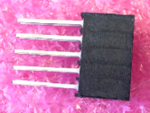
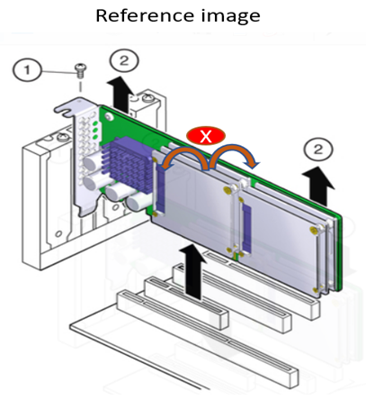

# Board Installation Guidelines: Intel® FPGA SmartNIC N6000/1-PL, Intel® FPGA PAC D5005

Last updated: **March 20, 2024** 

## 1.0 Introduction

### 1.1 About This Document

The purpose of this document is to educate users of the following acceleration platforms on board installation and server environment setup - the Intel® FPGA SmartNIC N6000/1-PL and the Intel® FPGA PAC D5005. After reading the document a user shall be able to:

- Safely install and remove an ADP
- Set up their server BIOS with the recommended settings
- Learn about thermal cooling requirements for their platform

This document will include notes where board installation or information differs between platforms. If no such note exists, you may assume it is applicable to all three platforms.

### 1.2 Audience

The information in this document is intended for customers evaluating the PCIe Attach shell on supported ADP platforms. This reference is a starting point for evaluation and development of the OFS compliant shell designs and workloads. This document will not cover software installation or platform validation, as those are shown in their respective documents.

*Note: Code command blocks are used throughout the document. Full command output may not be shown for the sake of brevity.*

#### Table 1: Terminology

| Term                      | Abbreviation | Description                                                  |
| :------------------------------------------------------------:| :------------:| ------------------------------------------------------------ |
|Advanced Error Reporting	|AER	|The PCIe AER driver is the extended PCI Express error reporting capability providing more robust error reporting. [(link)](https://docs.kernel.org/PCI/pcieaer-howto.html?highlight=aer)|
|Accelerator Functional Unit	|AFU	|Hardware Accelerator implemented in FPGA logic which offloads a computational operation for an application from the CPU to improve performance. Note: An AFU region is the part of the design where an AFU may reside. This AFU may or may not be a partial reconfiguration region.|
|Basic Building Block	|BBB|	Features within an AFU or part of an FPGA interface that can be reused across designs. These building blocks do not have stringent interface requirements like the FIM's AFU and host interface requires. All BBBs must have a (globally unique identifier) GUID.|
|Best Known Configuration	|BKC	|The software and hardware configuration Intel uses to verify the solution.|
|Board Management Controller|	BMC	|Supports features such as board power managment, flash management, configuration management, and board telemetry monitoring and protection. The majority of the BMC logic is in a separate component, such as an Intel® Max® 10 or Intel Cyclone® 10 device; a small portion of the BMC known as the PMCI resides in the main Agilex FPGA.
|Configuration and Status Register	|CSR	|The generic name for a register space which is accessed in order to interface with the module it resides in (e.g. AFU, BMC, various sub-systems and modules).|
|Data Parallel C++	|DPC++|	DPC++ is Intel’s implementation of the SYCL standard. It supports additional attributes and language extensions which ensure DCP++ (SYCL) is efficiently implanted on Intel hardware.
|Device Feature List	|DFL	| The DFL, which is implemented in RTL, consists of a self-describing data structure in PCI BAR space that allows the DFL driver to automatically load the drivers required for a given FPGA configuration. This concept is the foundation for the OFS software framework. [(link)](https://docs.kernel.org/fpga/dfl.html)|
|FPGA Interface Manager	|FIM|	Provides platform management, functionality, clocks, resets and standard interfaces to host and AFUs. The FIM resides in the static region of the FPGA and contains the FPGA Management Engine (FME) and I/O ring.|
|FPGA Management Engine	|FME	|Performs reconfiguration and other FPGA management functions. Each FPGA device only has one FME which is accessed through PF0.|
|Host Exerciser Module	|HEM	|Host exercisers are used to exercise and characterize the various host-FPGA interactions, including Memory Mapped Input/Output (MMIO), data transfer from host to FPGA, PR, host to FPGA memory, etc.|
|Input/Output Control|	IOCTL	|System calls used to manipulate underlying device parameters of special files.|
|Intel Virtualization Technology for Directed I/O	|Intel VT-d	|Extension of the VT-x and VT-I processor virtualization technologies which adds new support for I/O device virtualization.|
|Joint Test Action Group	|JTAG	| Refers to the IEEE 1149.1 JTAG standard; Another FPGA configuration methodology.|
|Memory Mapped Input/Output	|MMIO|	The memory space users may map and access both control registers and system memory buffers with accelerators.|
|oneAPI Accelerator Support Package	|oneAPI-asp	|A collection of hardware and software components that enable oneAPI kernel to communicate with oneAPI runtime and OFS shell components. oneAPI ASP hardware components and oneAPI kernel form the AFU region of a oneAPI system in OFS.|
|Open FPGA Stack	|OFS|	OFS is a software and hardware infrastructure providing an efficient approach to develop a custom FPGA-based platform or workload using an Intel, 3rd party, or custom board. |
|Open Programmable Acceleration Engine Software Development Kit|	OPAE SDK|	The OPAE SDK is a software framework for managing and accessing programmable accelerators (FPGAs). It consists of a collection of libraries and tools to facilitate the development of software applications and accelerators. The OPAE SDK resides exclusively in user-space.|
|Platform Interface Manager	|PIM|	An interface manager that comprises two components: a configurable platform specific interface for board developers and a collection of shims that AFU developers can use to handle clock crossing, response sorting, buffering and different protocols.|
|Platform Management Controller Interface|	PMCI|	The portion of the BMC that resides in the Agilex FPGA and allows the FPGA to communicate with the primary BMC component on the board.|
|Partial Reconfiguration	|PR	|The ability to dynamically reconfigure a portion of an FPGA while the remaining FPGA design continues to function. For OFS designs, the PR region is referred to as the pr_slot.|
|Port|	N/A	|When used in the context of the fpgainfo port command it represents the interfaces between the static FPGA fabric and the PR region containing the AFU.|
|Remote System Update|	RSU	|The process by which the host can remotely update images stored in flash through PCIe. This is done with the OPAE software command "fpgasupdate".|
|Secure Device Manager	|SDM|	The SDM is the point of entry to the FPGA for JTAG commands and interfaces, as well as for device configuration data (from flash, SD card, or through PCI Express* hard IP).|
|Static Region|	SR	|The portion of the FPGA design that cannot be dynamically reconfigured during run-time.|
|Single-Root Input-Output Virtualization|	SR-IOV	|Allows the isolation of PCI Express resources for manageability and performance.|
|SYCL	|SYCL|	SYCL (pronounced "sickle") is a royalty-free, cross-platform abstraction layer that enables code for heterogeneous and offload processors to be written using modern ISO C++ (at least C++ 17). It provides several features that make it well-suited for programming heterogeneous systems, allowing the same code to be used for CPUs, GPUs, FPGAs or any other hardware accelerator. SYCL was developed by the Khronos Group, a non-profit organization that develops open standards (including OpenCL) for graphics, compute, vision, and multimedia. SYCL is being used by a growing number of developers in a variety of industries, including automotive, aerospace, and consumer electronics.|
|Test Bench	|TB	|Testbench or Verification Environment is used to check the functional correctness of the Design Under Test (DUT) by generating and driving a predefined input sequence to a design, capturing the design output and comparing with-respect-to expected output.|
|Universal Verification Methodology	|UVM	|A modular, reusable, and scalable testbench structure via an API framework.  In the context of OFS, the UVM enviroment provides a system level simulation environment for your design.|
|Virtual Function Input/Output	|VFIO	|An Input-Output Memory Management Unit (IOMMU)/device agnostic framework for exposing direct device access to userspace. (link)|

### 1.3 Required Hardware for Installation

#### Table 2: Intel N6000/1-PL FPGA SmartNIC Platform SKU Mapping

The following table highlights the differences between N6000/1 PL FPGA SmartNIC platforms (SKU1/SKU2). Use this table to identify which version of the N6000/1-PL FPGA SmartNIC platforms you have if you are unsure. The board identification printed by the `fpgainfo fme` commands depends on both the OPAE SDK and Linux DFL drivers from sections, whose installation is covered in the [Software Installation Guide: Open FPGA Stack for PCIe Attach](../../sw_installation/pcie_attach/sw_install_pcie_attach.md).

| SKU Mapping | SKU Value | Primary Difference| `fpgainfo` Identification|
| --------- | ------- | ----- | ----- |
|N6000| Q1613314XXXXX | PCIe Gen 4 1x16 mechanical bifurcated 2x8 logical to host, with one PCIe Gen 4x8 endpoint reserved for Intel E810-C-CAM2 NIC, the other reserved for FIM| "Intel Acceleration Development Platform N6000"|
|N6001| Q0216514XXXXX | PCIe Gen 4 1x16 mechanical and logical connection between host and FIM| "Intel Acceleration Development Platform N6001"|

The following table provides a picture reference for the hardware components discussed in the rest of the document.

#### Table 3: Hardware BKC

| Component | Image |
| --------- | ------- |
| Intel® FPGA SmartNIC N6001-PL (SKU2) |  |
| Supermicro Server SYS-220HE | |
| Intel FPGA Download Cable II (Only Required for manual flashing) | |
| 2x5 Extension header - Samtech Part No: ESQ-105-13-L-D (Only Required for manual flashing) | |

In addition to the above, all OFS ADP platforms require an auxillary power cable for the 12 V-Auxiliary 2x4 PCIe* power connector. This cable will differ between server vendors - review the pinout of the power connector on the [Intel® FPGA Programmable Acceleration Card D5005 Data Sheet](https://www.intel.com/content/www/us/en/docs/programmable/683568/current/power.html) or [Intel FPGA SmartNIC N6001-PL Data Sheet - SKU2](https://www.intel.com/content/www/us/en/search.html?ws=text#q=n6001%20data%20sheet&sort=relevancy) (content ID=723837) as a reference for ordering. Although this is *not always the case*, often the standard 2x4 PCIe power connector that is required to enable a GPU in your server will also work for an FPGA-based ADP.

## 2.0 Initial Server Setup

### 2.1 Server Information for Intel® FPGA SmartNIC N6000/1-PL

Both the server BIOS and BMC need to match the versions listed below in [Table 4: Supermicro Server BMC BKC](#table-4-supermicro-server-bmc-bkc). These updates only apply for this specific Best Known Configuration (BKC) - other server manufacturers may require different BIOS updates. Please consult your server's user guide and release notes for update information.

#### Table 4: SuperMicro Server BMC BKC

| Component| Version|
| -----| -----|
| BIOS Version| American Megatrends International, LLC(1.4) |

Information about the server’s currently loaded firmware can be found on the BMC
web portal dashboard. Accessing this page requires an Ethernet cable to be attached
to an open port on the server labelled “IPMI”. During boot the BMC’s login IP will be
presented on the screen.

Open this IP address in a browser and enter your login credentials. The default
username is ADMIN, and the default password has been printed on the service tag
that pulls out from the front of the server case. It is recommended the user change
their BMC’s default username as soon as they are able.

After logging in you should be able to review information about the BMC and BIOS by
referring to the System box, visible upon initial loading of the page. Double check that
the values match those in Table 4. If they do not, you
may download the appropriate versions from the [SuperMicro product page](https://www.supermicro.com/en/products/system/Hyper/2U/SYS-220HE-FTNR) by
selecting the BIOS option and downloading the most recent “Bundled Software File
Name”. Follow the BMC and BIOS update instructions included in the
[SuperMicro manuals page](https://www.supermicro.com/support/manuals/?mlg=0) in the document **X12/H12 BMC Manual** in **Appendix A.2 Updating Firmware Using BMC Web GUI**.

If using a different server model, refer to that server’s user guide for instructions on remote system management. Ensure that any system you end up using meets all the following requirements:

- Main Board: PCI Express 3.0 (D5005) or 4.0 (N6000/1) compliant motherboard with at least one dual-width x16 PCIe slot available for card installation
- Board Power Supply: Auxiliary Power (12V)

### 2.2 Server Information for Intel® FPGA PAC D5005

Refer to sections 2.1-2.3 of the [Intel Acceleration Stack Quick Start Guide: Intel FPGA Programmable Acceleration Card D5005](https://www.intel.com/content/www/us/en/programmable/documentation/edj1542148561811.html) for a complete overview of the physical installation process and ESD precautions for the D5005 platform.

Ensure that the system meets all the following requirements before proceeding to install the Intel® FPGA PAC D5005 into a server.

- Main Board: PCI Express 3.0 compliant motherboard with at least one dual-width x16 PCIe slot available for card installation
- Board Power Supply: Auxiliary Power (12V)

Detailed mechanical for information can be found on the [D5005 Data Sheet](https://www.intel.com/content/www/us/en/docs/programmable/683568/current/mechanical-information.html) and in section 4.0 Mechanical Information of the [Intel FPGA SmartNIC N6001-PL Data Sheet - SKU2](https://www.intel.com/content/www/us/en/search.html?ws=text#q=n6001%20data%20sheet&sort=relevancy) (content ID=723837).

## 3.0 Server Settings

### 3.1 BIOS Settings

You must enable Intel VT-x/VT-d technologies for the PCIe slot housing your ADP. The following steps are known to work on a SuperMicro SYS-220HE server platform.

1. To enter the Supermicro server’s BIOS setup page, reboot, and press \<Delete\> when prompted. You can browse the tabs / options with a combination of arrow keys along with \<Escape\> and \<Enter\>.

2. Navigate right to the **Advanced** tab, then select the following menu options: **Chipset Configuration** -> **North Bridge** -> **IIO Configuration** -> **Intel VT for Directed I/O (VT-d)**.

3. If not already, enable the option **Intel VT for Directed I/O (VT-d)**.

### 3.1 Server Fan Speed

The recommended fan speed setting is to use the 100% preset. If using a different
server model, refer to that server’s user guide for instructions on changing fan
speed. The following steps will help users on the SuperMicro platform.

1. Log in to the SuperMicro server BMC. (This requires an Ethernet cable to be attached to an open port on the server labelled “IPMI”.)
2. During boot the BMC’s login IP will be presented on the screen. Open this IP address in a browser and enter your login credentials. The default username is ADMIN, and the default password has been printed on the service tag that pulls out from the front of the server case.
3. On the left menu select **System** -> **Component Info**, select the **Fan** tab, under **Advanced Settings** click the circle next to **Full Speed**.

### 3.2 Cooling Requirements

Please refer to sections 8.1 and 8.2 of the [Intel FPGA Programmable Acceleration Card D5005 Data Sheet](https://www.intel.com/content/www/us/en/docs/programmable/683568/current/thermal-and-airflow-requirements.html) or section 6.0 of the [Intel FPGA SmartNIC N6001-PL Data Sheet - SKU2](https://www.intel.com/content/www/us/en/search.html?ws=text#q=n6001%20data%20sheet&sort=relevancy) (content ID=723837) for guidance on cooling specifications that must be met when using these platforms. Failure to adhere to these guidelines may result in thermal runaway and/or performance degradation.

## 4.0 Board Installation Procedure

### 4.1 PCIe Slot Mappings for Intel® FPGA SmartNIC N6000/1-PL

The Intel N6000/1-PL FPGA SmartNIC Platforms are officially verified in the upper middle PCIe x16 slot (Slot 3). If using a different slot, refer to the information in [Table 5 PCIe Slot Mapping](#table-5-pcie-slot-mapping) for which port settings to change in server BIOS.

#### Table 5: PCIe Slot Mapping

| CPU Number| Port Number (in BIOS)| PCIe Slot|
| -----| -----| -----|
| CPU1| Port 2| 5 and 6|
| CPU1| Port 4| 7 and 8|
| CPU2| Port 2| 1 and 2|
| CPU2| Port 4| 3 and 4|

### 4.2 Installation Procedure for The Intel® FPGA PAC D5005 and Intel® FPGA SmartNIC N6000/1-PL into a Server

The following instructions will help to ensure safe installation of an ADP platform into a supported server. While an Intel® FPGA SmartNIC N6001-PL is shown in the images below, this procedure applies to all three platforms.

1. Position the board over the selected connector on the motherboard.
2. Press down gently and firmly to seat the card in the PCIe slot, and then secure the bracket to the system chassis with the retention screw.

#### Table 6: ADP Installation Procedure

| Callout | Description |
| -----| -----|
| 1| Retention screw|
| 2| Press down here gently|
| 3| Press down here gently|
| 4| Motherboard|

Do not bend the card while inserting into a slot. Do not apply much pressure in regions 2 or 3 while inserting.

### 4.3 Removal Procedure for The Intel® FPGA PAC D5005 and Intel® FPGA SmartNIC N6000/1-PL into a Server

The following instructions will help to ensure safe removal of the platforms from a supported server.

1. Disconnect all power cords from the server power supply(s).
2. Remove the retention bracket screw.
3. Carefully lift the card out of the PCIe slot.

#### Table 7: ADP Removal Procedure

| Callout | Description |
| -----| -----|
| 1| Retention screw|
| 2| Pull up here gently|
| 3| Motherboard|

Do not bend the card while removing it from the slot.

