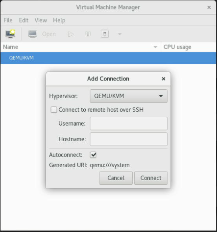
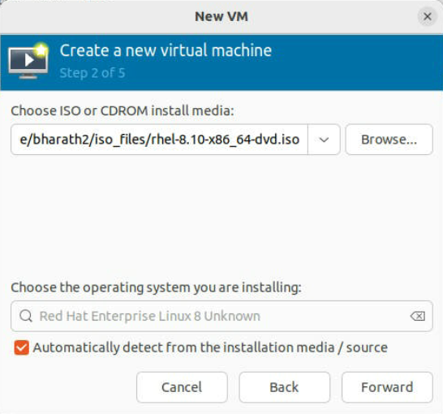
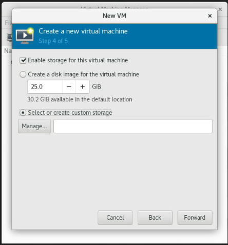
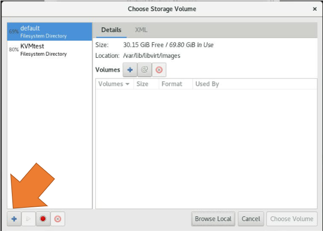
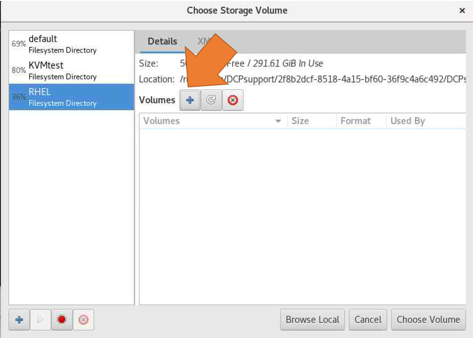
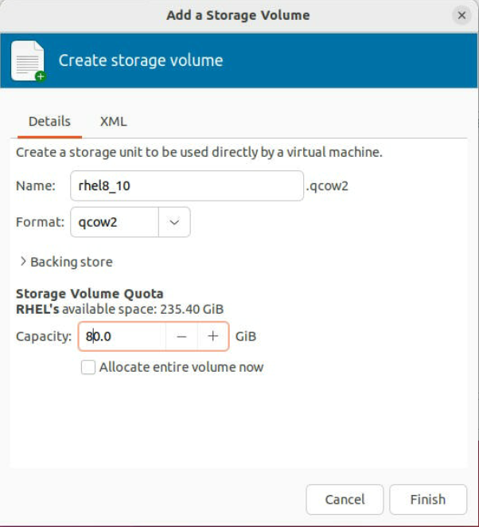

Virtual machine User Guide: Open FPGA Stack + KVM 
===

Last updated: **July 13, 2023** 

## Terms and Acronyms

| Term                      | Abbreviation | Description                                                  |
| :------------------------------------------------------------:| :------------:| ------------------------------------------------------------ |
|Advanced Error Reporting	|AER	|The PCIe AER driver is the extended PCI Express error reporting capability providing more robust error reporting. [(link)](https://docs.kernel.org/PCI/pcieaer-howto.html?highlight=aer)|
|Accelerator Functional Unit	|AFU	|Hardware Accelerator implemented in FPGA logic which offloads a computational operation for an application from the CPU to improve performance. Note: An AFU region is the part of the design where an AFU may reside. This AFU may or may not be a partial reconfiguration region.|
|Basic Building Block	|BBB|	Features within an AFU or part of an FPGA interface that can be reused across designs. These building blocks do not have stringent interface requirements like the FIM's AFU and host interface requires. All BBBs must have a (globally unique identifier) GUID.|
|Best Known Configuration	|BKC	|The software and hardware configuration Intel uses to verify the solution.|
|Board Management Controller|	BMC	|Supports features such as board power managment, flash management, configuration management, and board telemetry monitoring and protection. The majority of the BMC logic is in a separate component, such as an Intel® Max® 10 or Intel Cyclone® 10 device; a small portion of the BMC known as the PMCI resides in the main Agilex FPGA.
|Configuration and Status Register	|CSR	|The generic name for a register space which is accessed in order to interface with the module it resides in (e.g. AFU, BMC, various sub-systems and modules).|
|Data Parallel C++	|DPC++|	DPC++ is Intel’s implementation of the SYCL standard. It supports additional attributes and language extensions which ensure DCP++ (SYCL) is efficiently implanted on Intel hardware.
|Device Feature List	|DFL	| The DFL, which is implemented in RTL, consists of a self-describing data structure in PCI BAR space that allows the DFL driver to automatically load the drivers required for a given FPGA configuration. This concept is the foundation for the OFS software framework. [(link)](https://docs.kernel.org/fpga/dfl.html)|
|FPGA Interface Manager	|FIM|	Provides platform management, functionality, clocks, resets and standard interfaces to host and AFUs. The FIM resides in the static region of the FPGA and contains the FPGA Management Engine (FME) and I/O ring.|
|FPGA Management Engine	|FME	|Performs reconfiguration and other FPGA management functions. Each FPGA device only has one FME which is accessed through PF0.|
|Host Exerciser Module	|HEM	|Host exercisers are used to exercise and characterize the various host-FPGA interactions, including Memory Mapped Input/Output (MMIO), data transfer from host to FPGA, PR, host to FPGA memory, etc.|
|Input/Output Control|	IOCTL	|System calls used to manipulate underlying device parameters of special files.|
|Intel Virtualization Technology for Directed I/O	|Intel VT-d	|Extension of the VT-x and VT-I processor virtualization technologies which adds new support for I/O device virtualization.|
|Joint Test Action Group	|JTAG	| Refers to the IEEE 1149.1 JTAG standard; Another FPGA configuration methodology.|
|Memory Mapped Input/Output	|MMIO|	The memory space users may map and access both control registers and system memory buffers with accelerators.|
|oneAPI Accelerator Support Package	|oneAPI-asp	|A collection of hardware and software components that enable oneAPI kernel to communicate with oneAPI runtime and OFS shell components. oneAPI ASP hardware components and oneAPI kernel form the AFU region of a oneAPI system in OFS.|
|Open FPGA Stack	|OFS|	OFS is a software and hardware infrastructure providing an efficient approach to develop a custom FPGA-based platform or workload using an Intel, 3rd party, or custom board. |
|Open Programmable Acceleration Engine Software Development Kit|	OPAE SDK|	The OPAE SDK is a software framework for managing and accessing programmable accelerators (FPGAs). It consists of a collection of libraries and tools to facilitate the development of software applications and accelerators. The OPAE SDK resides exclusively in user-space.|
|Platform Interface Manager	|PIM|	An interface manager that comprises two components: a configurable platform specific interface for board developers and a collection of shims that AFU developers can use to handle clock crossing, response sorting, buffering and different protocols.|
|Platform Management Controller Interface|	PMCI|	The portion of the BMC that resides in the Agilex FPGA and allows the FPGA to communicate with the primary BMC component on the board.|
|Partial Reconfiguration	|PR	|The ability to dynamically reconfigure a portion of an FPGA while the remaining FPGA design continues to function. For OFS designs, the PR region is referred to as the pr_slot.|
|Port|	N/A	|When used in the context of the fpgainfo port command it represents the interfaces between the static FPGA fabric and the PR region containing the AFU.|
|Remote System Update|	RSU	|The process by which the host can remotely update images stored in flash through PCIe. This is done with the OPAE software command "fpgasupdate".|
|Secure Device Manager	|SDM|	The SDM is the point of entry to the FPGA for JTAG commands and interfaces, as well as for device configuration data (from flash, SD card, or through PCI Express* hard IP).|
|Static Region|	SR	|The portion of the FPGA design that cannot be dynamically reconfigured during run-time.|
|Single-Root Input-Output Virtualization|	SR-IOV	|Allows the isolation of PCI Express resources for manageability and performance.|
|SYCL	|SYCL|	SYCL (pronounced "sickle") is a royalty-free, cross-platform abstraction layer that enables code for heterogeneous and offload processors to be written using modern ISO C++ (at least C++ 17). It provides several features that make it well-suited for programming heterogeneous systems, allowing the same code to be used for CPUs, GPUs, FPGAs or any other hardware accelerator. SYCL was developed by the Khronos Group, a non-profit organization that develops open standards (including OpenCL) for graphics, compute, vision, and multimedia. SYCL is being used by a growing number of developers in a variety of industries, including automotive, aerospace, and consumer electronics.|
|Test Bench	|TB	|Testbench or Verification Environment is used to check the functional correctness of the Design Under Test (DUT) by generating and driving a predefined input sequence to a design, capturing the design output and comparing with-respect-to expected output.|
|Universal Verification Methodology	|UVM	|A modular, reusable, and scalable testbench structure via an API framework.  In the context of OFS, the UVM enviroment provides a system level simulation environment for your design.|
|Virtual Function Input/Output	|VFIO	|An Input-Output Memory Management Unit (IOMMU)/device agnostic framework for exposing direct device access to userspace. (link)|
 

## Document scope 

The document describes setting up and configuring a virtual machine to use PCIe devices. Here are the steps that the document may include:

1. Install the necessary tools, such as virt-manager, on the host machine. This may involve downloading and installing the software from the internet.
2. Enable the virtualization feature on the host machine. This may involve going into the BIOS settings and enabling hardware-assisted virtualization or using a command-line tool to enable it in the operating system.
3. Use virt-manager to create a new virtual machine and configure its settings. This may involve choosing a name and operating system for the virtual machine and setting the amount of memory and storage it will use.
4. Install the OPAE (Open Programmable Acceleration Engine) tool on the virtual machine. This may involve downloading and installing the OPAE software.
5. Install the DFL (Data Field Level) drivers on the virtual machine. These drivers allow the virtual machine to access and use the PCIe devices on the host machine. This may involve downloading and installing the drivers from the internet.
6. Once all of the steps have been completed, you should be able to use the virtual machine to access and use the PCIe devices on the host machine. You may need to configure the virtual machine's settings to enable it to use the PCIe devices, such as by assigning a specific device to the virtual machine.


## 1. Verify if the virtualization is enabled.

To check if virtualization is enabled on a Red Hat system using `lscpu` and `grep`, you can use the following command:

```sh
lscpu -e | grep Virtualization
```

This command will run `lscpu` with the `-e` or `--extended` option, which displays information about the CPU and its available virtualization capabilities. Then, it pipes the output to `grep` with the search pattern "Virtualization". If the system has support for virtualization, the output will show the "Virtualization" field and its value, for example:

```sh
Virtualization: VT-x
```

In this example, the output shows that the system supports Intel VT-x virtualization technology. If the "Virtualization" field is empty, the system does not have support for virtualization. Keep in mind that even if the system has support for virtualization, it may not be enabled in the BIOS or the operating system itself. 

Check the following for the bios configuration, [**Enabling Intel VT-d Technology**](https://github.com/intel-innersource/applications.fpga.ofs.documentation/blob/ritesh_n600x_gs_ww49/n600x/user_guides/ofs_getting_started/ug_qs_ofs_n600x.md#enabling-intel-vt-d-technology)

## 2. Verify if the virtualization modules are loaded

1. Open a terminal window and log in as a user with sudo privileges.
2. Check if the virtualization kernel modules are loaded by running the following command:

```
lsmod | grep kvm
```

3. If the command outputs a list of modules, the virtualization kernel modules are loaded, and virtualization is enabled on your system.

4. The virtualization kernel modules are not loaded if the command does not output anything. You can try loading them manually by running the following command:

```
sudo modprobe kvm
```

5. If the kernel modules are not loaded, and you cannot load them manually, it may be because virtualization is not supported or enabled in your system's BIOS or UEFI settings. You must reboot your system and enter the BIOS or UEFI settings menu to enable virtualization. The exact steps for doing this may vary depending on your system's hardware and BIOS/UEFI version, so consult your motherboard or system documentation for specific instructions.

## 3. Install Virtual Machine Manager

Virtual Machine Manager (also known as libvirt) on follow these steps:

1. Open a terminal window and log in as a user with sudo privileges.
2. Update your system package index by running the following command:
   * Redhat 

   ```sh
   sudo dnf update
   ```
   * Ubuntu
   ```SH
   sudo apt update
   ```

3. Install the libvirt package and any required dependencies by running the following command:

   * Redhat 

   ```sh
   sudo dnf install @virtualization
   ```

   * Ubuntu

   ```SH
   sudo apt install qemu-kvm libvirt-bin bridge-utils virt-manager
   ```

4. Start the libvirtd service and enable it to start automatically at boot time by running the following commands:

```sh
sudo systemctl start libvirtd
sudo systemctl enable libvirtd
```

5. Optional: Install the virt-manager package, which provides a GUI application for managing virtual machines, by running the following command:

```sh
sudo dnf install virt-manager
```

6. Optional: If you want to be able to run virtual machines as a non-root user, add your user to the libvirt group by running the following command, replacing "USERNAME" with your username:

```sh
sudo usermod -a -G libvirt USERNAME
```

7. You can now launch virt-manager by running the command `virt-manager` as the non-root user.

Note: By default, virt-manager will only allow non-root users to create and manage virtual machines with limited resources, such as a limited amount of memory and CPU cores. To allow non-root users to create and manage virtual machines with more resources, you need to edit the `/etc/libvirt/qemu.conf` configuration file and set the `user` and `group` values for the `dynamic_ownership` option to `1`. For example:

```
# Set user and group ownership of dynamic /dev/kvm device nodes
dynamic_ownership = 1
user = "root"
group = "root"
```

You will also need to restart the libvirtd service for the changes to take effect. You can do this by running the command. 

```sh
sudo systemctl restart libvirtd
```

8. Reboot your server to apply the changes 

```sh
reboot
```

After completing these steps, you should be able to use the virt-manager GUI application to manage virtual machines on your system. 

## 4. How to create a Virtual Machine?

Before creating the virtual machine, ensure the DFL drivers are installed in your host machine; the instructions are located here, [OFS Site](https://ofs.github.io) select your desired platform and select Getting stated guide.

To create a Red Hat 8.2 or Ubuntu 22.04  virtual machine (VM) using `virt-manager` and share PCI devices with the VM, you will need to perform the following steps:

1. Start the `virt-manager` GUI by running the following command:

```sh
sudo virt-manager&
```


2. Create a new connection from the menu File-> "Add Connection," Use the default options and click "Connect."

   

   

3. In the `virt-manager` window, click the "New virtual machine" button.

   

4. In the "New VM" wizard, select "Local install media (ISO image or CDROM)" as the installation source, and then click "Forward."

   

   * Get the Red Hat image from the following link.

     https://developers.redhat.com/content-gateway/file/rhel-8.2-x86_64-dvd.iso

   * Get the Ubuntu image from the following link.

     https://releases.ubuntu.com/22.04/ubuntu-22.04.1-desktop-amd64.iso

5. In the next step, Click Browse -> Browse local, select the Red Hat 8.2 ISO image as the installation source and click "Forward".

   

   

   Note: if the system is not detected, disable "Automatic detected from the installation media/source" and type ubuntu and select 19.10 (this should be fine for the 22.04); this step is necessary to copy the default values for the specific OS

   

6. In the next step, specify a name and location for the VM, and select the desired memory and CPU configuration. in our case, 16 cores and 64 GB of RAM; Click "Forward" to continue.

   

7. Select "enable storage for this virtual machine," Select "Create a new disk for the virtual machine," and enter a size for the virtual disk (at least 200~300GB in case you need to compile the design) or create a custom storage.

   

   1. If you need to create custom storage, select "Select or Create custom storage" and click "Manage."

      

   2. Click on the "+" icon (Bottom left) to create the storage pool.

      

   3. In the "Create a new storage pool" dialog, enter a name for the storage pool and select the type of storage pool you want to create; select the Target Path and Click "Finish."

      

   4. Select the pool and later click on the "+" icon (The Icon is on the right side of the Volume label) to create the New Storage Volume.

      

   5. In the "Create Storage Volume" dialog, Define the name and format (keep with the default qcow2) and select the Max Capacity (at least 200~300GB  in case you need to compile the design); click "Finish" to create the disk.

      

   6. Once the disk is created, it will appear in your virtual machine's list of storage devices. You can now use this disk just like any other disk. Select from the list and Click "Choose Volume."

      

   

8. In the next step, select the "Customize configuration before install" option and click "Finish."

   

9. In the "Overview" tab, select "Add Hardware," choose "PCI Host Device" from the drop-down menu and choose the PCI device you want to share with the VM. Click "Apply" to apply the changes, and then click "Finish" to create the VM.

   

   

   

   

   * If you are not sure about the devices you want to share, follow the following instructions:

     1. under the host machine, open the console and run the following command to find your device:

        ```sh 
        sudo fpgainfo fme
        ```

     2. The output of the previous command should look like this:

        ```sh
        Intel Acceleration Development Platform N6001
        Board Management Controller NIOS FW version: 3.2.0
        Board Management Controller Build version: 3.2.0
        //****** FME ******//
        Object Id                        : 0xED00000
        PCIe s:b:d.f                     : 0000:B1:00.0
        Vendor Id                        : 0x8086
        Device Id                        : 0xBCCE
        SubVendor Id                     : 0x8086
        SubDevice Id                     : 0x1771
        Socket Id                        : 0x00
        Ports Num                        : 01
        Bitstream Id                     : 0x50102022267A9ED
        Bitstream Version                : 5.0.1
        Pr Interface Id                  : f59830f7-e716-5369-a8b0-e7ea897cbf82
        Boot Page                        : user1
        Factory Image Info               : a2b5fd0e7afca4ee6d7048f926e75ac2
        User1 Image Info                 : a8b0e7ea897cbf82f59830f7e7165369
        User2 Image Info                 : af84ddd1166009d09df0c826cf095145
        ```

     3. The Device Address is B1:00.0; in our case, we need to use the B1:00.0 to B1:00.4 address.

10. Edit the XML file for your machine and include the following

    1. < ioapic driver='qemu'/> inside of features:

       ```xml
       <features>
       	<acpi/>
       	<apic/>
       	<ioapic driver='qemu'/>
       </features>
       ```

    2. Inside of devices

       ```xml
       <devices>
           ........
           ......
           <iommu model='intel'>
           	<driver intremap='on' caching_mode='on'/>
           </iommu>
       </devices>
       ```

    3. Ensure the hard limit is setup correctly otherwise you can only pass one device:

       ```xml
       <memtune>
       	<hard_limit unit='G'>64</hard_limit>
       </memtune>
       ```

    4. Save the changes "Apply"

11. On the host machine append intel_iommu=on to the end of the GRUB_CMDLINE_LINUX line in the grub configuration file.
    ```sh
    nano /etc/default/grub
    ......
    GRUB_CMDLINE_LINUX="....... ... intel_iommu=on"
    ...
    #Refresh the grub.cfg file for these changes to take effect
    
    grub2-mkconfig -o /boot/grub2/grub.cfg
    shutdown -r now
    ```

    

12. Ensure your devices are enumerated properly.

    1. Example in you host system should look like this:
      B1:00.0
      B1:00.1
      B1:00.2
      B1:00.3
      B1:00.4
    2. Under the virtual machine (The PCIe Address is an example you could get a different
      number):
      177:00.0
      177:00.1
      177:00.2
      177:00.3
      177:00.4

13. Click on "Begin Installation." and follow the wizard installation of the OS. 

    

14. Once the VM is created, you can start it by selecting it in the `virt-manager` window and clicking the "Run" button. This will boot the VM and start the Red Hat 8.2/Ubuntu installation process. Follow the on-screen instructions to complete the installation.

    

    

15. Under your virtual machine, configure your VM proxy:

    * Redhat [How to apply a system-wide proxy?](https://access.redhat.com/solutions/1351253)
    * Ubuntu [Define proxy settings](https://help.ubuntu.com/stable/ubuntu-help/net-proxy.html.en)
    * [Configure Git to use a proxy](https://gist.github.com/evantoli/f8c23a37eb3558ab8765)

16. To include OPAE in your virtual machine, follow the instructions from the following link  [OFS Site](https://ofs.github.io) select your desired platform and select Getting stated guide. To install the DFL drivers, please follow the instructions from the following link  [OFS Site](https://ofs.github.io) select your desired platform and select Getting stated guide.

17. Use the OPAE SDK tool opae.io (under your virtual machine) to check default driver binding using your card under test PCIe B:D.F. 

    ```sh
    sudo fpgainfo fme
    
    Intel Acceleration Development Platform N6001
    Board Management Controller NIOS FW version: 3.2.0 
    Board Management Controller Build version: 3.2.0 
    //****** FME ******//
    Object Id                        : 0xED00001
    PCIe s:b:d.f                     : 0000:B1:00.0
    
    sudo opae.io init -d 0000:b1:00.0 $USER
    [0000:b1:00.0] (0x8086, 0xbcce) Intel N6001 ADP (Driver: dfl-pci)
    ```

18. The dfl-pci driver is used by OPAE SDK fpgainfo commands. The next steps will bind the card under test to the vfio driver to enable access to the registers.

```sh
sudo opae.io init -d 0000:B1:00.0 $USER

opae.io 0.2.3
Unbinding (0x8086,0xbcce) at 0000:b1:00.0 from dfl-pci
Binding (0x8086,0xbcce) at 0000:b1:00.0 to vfio-pci
iommu group for (0x8086,0xbcce) at 0000:b1:00.0 is 192
Assigning /dev/vfio/192 to DCPsupport
Changing permissions for /dev/vfio/192 to rw-rw----
```

17. Confirm the vfio driver is bound to the card under test.

```sh
opae.io ls
opae.io 0.2.3
[0000:b1:00.0] (0x8086, 0xbcce) Intel N6001 ADP (Driver: vfio-pci)
[0000:b1:00.1] (0x8086, 0xbcce) Intel N6001 ADP (Driver: dfl-pci)
[0000:b1:00.2] (0x8086, 0xbcce) Intel N6001 ADP (Driver: dfl-pci)
[0000:b1:00.4] (0x8086, 0xbcce) Intel N6001 ADP (Driver: dfl-pci)
```

After the installation, you can use `virt-manager` to manage and configure the VM, including setting up networking, attaching additional storage, and installing additional software. The shared PCI device will be available to the VM, allowing it to use it as if it were connected directly to the physical system.

## Notices & Disclaimers

Intel<sup>&reg;</sup> technologies may require enabled hardware, software or service activation.
No product or component can be absolutely secure. 
Performance varies by use, configuration and other factors.
Your costs and results may vary. 
You may not use or facilitate the use of this document in connection with any infringement or other legal analysis concerning Intel products described herein. You agree to grant Intel a non-exclusive, royalty-free license to any patent claim thereafter drafted which includes subject matter disclosed herein.
No license (express or implied, by estoppel or otherwise) to any intellectual property rights is granted by this document, with the sole exception that you may publish an unmodified copy. You may create software implementations based on this document and in compliance with the foregoing that are intended to execute on the Intel product(s) referenced in this document. No rights are granted to create modifications or derivatives of this document.
The products described may contain design defects or errors known as errata which may cause the product to deviate from published specifications.  Current characterized errata are available on request.
Intel disclaims all express and implied warranties, including without limitation, the implied warranties of merchantability, fitness for a particular purpose, and non-infringement, as well as any warranty arising from course of performance, course of dealing, or usage in trade.
You are responsible for safety of the overall system, including compliance with applicable safety-related requirements or standards. 
<sup>&copy;</sup> Intel Corporation.  Intel, the Intel logo, and other Intel marks are trademarks of Intel Corporation or its subsidiaries.  Other names and brands may be claimed as the property of others. 

OpenCL and the OpenCL logo are trademarks of Apple Inc. used by permission of the Khronos Group™.   
 