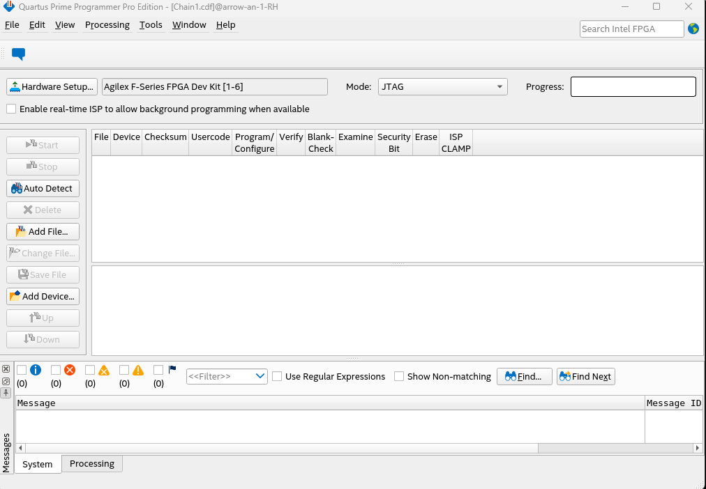

This walkthrough describes the steps to program the Agilex FPGA on the Intel® FPGA SmartNIC N6001-PL with a `SOF` image via JTAG.

Pre-Requisites:

* This walkthrough requires an OFS Agilex PCIe Attach deployment environment. Refer to the [OFS Agilex PCIe Attach Getting Started Guide] for instructions on setting up a deployment environment.

* This walkthrough requires a `SOF` image which will be programmed to the Agilex FPGA. Refer to the [Walkthrough: Compile OFS FIM] Section for step-by-step instructions for generating a `SOF` image.

* This walkthrough requires a JTAG connection to the n6001. Refer to the [Walkthrough: Set up JTAG] section for step-by-step instructions.

* This walkthrough requires a Full Quartus Installation or Standalone Quartus Prime Programmer & Tools running on the machine where the Intel® FPGA SmartNIC N6001-PL is connected via JTAG.

Steps:

1. Start in your deployment environment.

2. If the card is already programmed with an OFS enabled design, determine the PCIe B:D.F of the card using OPAE command `fpgainfo fme`. In this example, the PCIe B:D.F is `B1:00.0`.

  ```bash
  fpgainfo fme
  ```

  Example output:

  ```bash
  Intel Acceleration Development Platform N6001
  Board Management Controller NIOS FW version: 3.15.0
  Board Management Controller Build version: 3.15.0
  PBA: B#FB2CG1@AGF14-A0P2
  MMID: 217000
  SN: Q171211700050
  //****** FME ******//
  Interface                        : DFL
  Object Id                        : 0xEF00000
  PCIe s:b:d.f                     : 0000:98:00.0
  Vendor Id                        : 0x8086
  Device Id                        : 0xBCCE
  SubVendor Id                     : 0x8086
  SubDevice Id                     : 0x1771
  Socket Id                        : 0x00
  Ports Num                        : 01
  Bitstream Id                     : 360571655605884772
  Bitstream Version                : 5.0.1
  Pr Interface Id                  : d8fd88a7-8683-57ba-8be6-a1e058b7d4ed
  Boot Page                        : user1
  Factory Image Info               : 9035190d637c383453173deb5de25fdd
  User1 Image Info                 : 893e691edfccfd0aecb1c332ad69551b
  User2 Image Info                 : 8cd2ae8073e194525bcd682f50935fc7
  ```

3. Remove the card from PCIe prior to programming. This will disable AER for the PCIe root port to prevent a surprise link-down event during programming.

  ```bash
  sudo pci_device b1:00.0 unplug
  ```

4. Switch to the machine with JTAG connection to the n6001, if different than your deployment machine.

5. Open the Quartus programmer GUI

  ```bash
  quartus_pgmw
  ```

  

6. Click **Hardware Setup** to open the Hardware Setup dialog window.

  1. In the **Currently selected hardware** field select the n6001.

  2. In the **Hardware frequency** field enter `16000000` Hz

      

  3. Click **Close**

7. In the **Quartus Prime Programmer** window, click **Auto Detect**.

8. If prompted, select the AGFB014R24A2E2V device. The JTAG chain should show the divice.

  

9. Right click the AGFB014R24A2E2V row and selct **Change File**.

  

10. In the **Select New Programming File** window that opens, select the `.sof` image you wish to program and click **Open**.

11. Check the **Program/Configure** box for the AGFB014R24A2E2V row, then click **Start**. Wait for the **Progress** bar to show `100% (Success)`.

12. Close the Quartus Programmer GUI. You can answer 'No' if a dialog pops up asking to save the **'Chain.cdf'** file

13. Switch to the deployment environment, if different than the JTAG connected machine.

14. Replug the board PCIe

  ```bash
  sudo pci_device b1:00.0 plug
  ```

15. Run `fpgainfo fme` to verify communication with the board, and to check the PR Interface ID.

  ```bash
  Intel Acceleration Development Platform N6001
  Board Management Controller NIOS FW version: 3.15.0
  Board Management Controller Build version: 3.15.0
  PBA: B#FB2CG1@AGF14-A0P2
  MMID: 217000
  SN: Q171211700050
  //****** FME ******//
  Interface                        : DFL
  Object Id                        : 0xEF00000
  PCIe s:b:d.f                     : 0000:98:00.0
  Vendor Id                        : 0x8086
  Device Id                        : 0xBCCE
  SubVendor Id                     : 0x8086
  SubDevice Id                     : 0x1771
  Socket Id                        : 0x00
  Ports Num                        : 01
  Bitstream Id                     : 360571655605884772
  Bitstream Version                : 5.0.1
  Pr Interface Id                  : d8fd88a7-8683-57ba-8be6-a1e058b7d4ed
  Boot Page                        : user1
  Factory Image Info               : 9035190d637c383453173deb5de25fdd
  User1 Image Info                 : 893e691edfccfd0aecb1c332ad69551b
  User2 Image Info                 : 8cd2ae8073e194525bcd682f50935fc7
  ```
